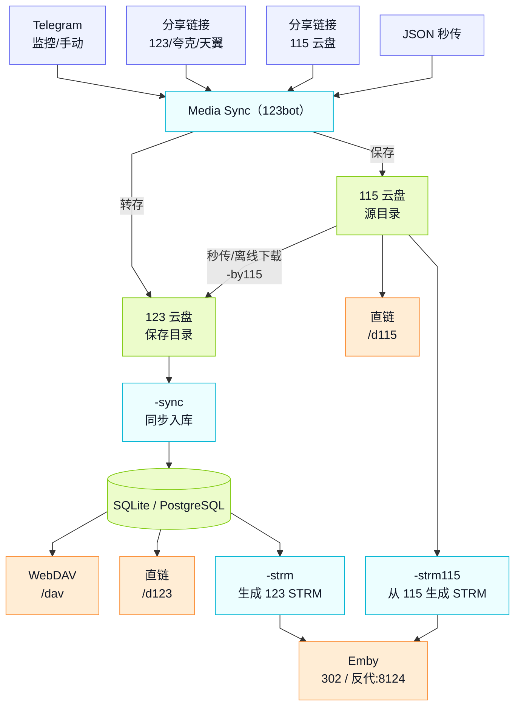

# Media Sync（123bot）

<p align="center">
  
</p>

Media Sync 是一个围绕「123 云盘」构建的媒体工作流工具：支持从多网盘/分享链接接收资源、同步元数据、生成 STRM、提供 WebDAV/直链播放，并提供 Web 可视化管理。

## 亮点

- 多来源接入：123/夸克/天翼/115 分享链接与 JSON 秒传统一接入
- 媒体工作流闭环：接收 → 整理 → 同步 → 直链/STRM → Emby 302 播放
- Web 可视化：文件管理、洗版（去重/清理）、迁移中心、订阅追更、配置面板
- 自动转存监控：配置频道/群组 ID，资源发布后自动转存
- 元数据驱动：媒体库信息存储于 SQLite/PostgreSQL，易迁移、可扩展
- 115 生态支持：扫码登录、签到、资源搬运至 123 云盘
- 播放更顺滑：直链/Emby 反代缓存与预热，降低起播耗时
- 部署友好：Docker 一键启动，默认端口清晰

## 一图看懂



## 快速开始（Docker）

需要准备：

- Docker Engine 与 Docker Compose（推荐 Compose v2）
- 端口：8122（Web/UI、WebDAV、直链）、8124（Emby 反代）
- 挂载目录：/app/media、/app/data、/app/logs

### Docker Compose（推荐）

```yaml
version: '3.9'
services:
  123bot:
    privileged: true
    container_name: 123bot
    image: dinding1/123bot:latest
    restart: always
    network_mode: bridge
    ports:
      - "8122:8122"
      - "8124:8124"
    environment:
      - TZ=Asia/Shanghai
      - PYTHONUNBUFFERED=1
      - PYTHONDONTWRITEBYTECODE=1
    volumes:
      - /path/to/media:/app/media
      - /path/to/data:/app/data
      - /path/to/logs:/app/logs
      - /var/run/docker.sock:/var/run/docker.sock
```

`/var/run/docker.sock` 用于支持 `-restart` 指令，仅建议在受控环境启用，不需要可移除。

## 初次配置（2 分钟）

1. 打开 Web：`http://服务器IP:8122/`
2. 进入“系统设置”，填写 Telegram 管理员 ID，并配置云盘/代理/Emby
3. 如需 115 功能，在页面进行“115 扫码登录”
4. 保存配置并刷新页面

TG API 申请地址：https://my.telegram.org （获取 api_id / api_hash）

## 使用方式

### 接收资源（手动）

- 发送 123/夸克/天翼/115 分享链接或 JSON 秒传文件，可实现自动转存到云盘指定目录

### 自动转存监控（频道/群组）

- 在 Web「系统设置」里填写“监控频道 ID 列表”（支持 `@username` 或数字 ID）
- 可选填写“推送群组 ID”，用于把转存结果推送到指定群组/频道
- 在被监控的频道/群组里发布分享链接/秒传内容，会自动转存到 123 云盘保存目录
- 用 `-id` 可快速查询当前群组/频道 ID

### 媒体同步与播放

- `-sync`：同步 123 云盘资源信息到数据库（用于检索、去重、文件管理、WebDAV/直链/STRM）
- `-strm` / `-strm115`：生成 STRM 到本地媒体目录
- WebDAV：`http://服务器IP:8122/dav`
- 直链：
  - 123：`http://服务器IP:8122/d123`
  - 115：`http://服务器IP:8122/d115`
- Emby 反代：监听 `8124`，支持 302 播放（需在 Web 配置）

### 数据库存储（SQLite/PostgreSQL）

- 媒体库的文件索引、去重信息、STRM 生成所需字段均落库，不需要把媒体下载到本地硬盘
- 默认使用 SQLite；可在系统设置启用 PostgreSQL，并用 `-sql迁移` / `-db迁移` 在两者间迁移（仅媒体信息）

## 指令速查

| 类别 | 指令 | 说明 |
|---|---|---|
| 基础 | `-start` | 系统信息 |
| 基础 | `-id` | 查询群组/频道 ID |
| 基础 | `-de` | 删除历史消息 |
| 媒体 | `-sync` | 云盘同步（将 123 视频信息同步至数据库） |
| 媒体 | `-strm` | 生成 123 云盘 STRM 到本地 |
| 媒体 | `-strm115` | 生成 115 云盘 STRM 到本地 |
| 媒体 | `-sub` | 下载字幕文件到本地 |
| 自动化 | `-export` | 导出秒传 JSON 文件 |
| 自动化 | `-export2` | 导出秒传 JSON 链接 |
| 115 | `-115签到` | 115 网盘签到与查询 |
| 115 | `-by115` | 115 资源搬运至 123 |
| 数据库 | `-sql迁移` | SQLite → PostgreSQL（仅媒体信息） |
| 数据库 | `-db迁移` | PostgreSQL → SQLite（仅媒体信息） |
| 运维 | `-restart` | 重启机器人（需挂载 Docker Socket） |

## 部署自检

- 访问 `http://服务器IP:8122/` 可打开页面
- Web“系统设置”保存配置有成功提示
- 发送 `-start` 能返回系统信息
- WebDAV 可被客户端挂载（如 rclone / Finder）
